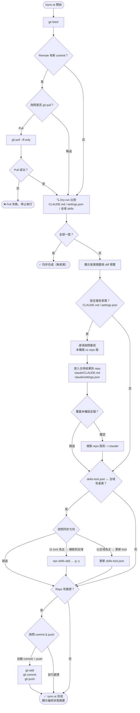

# sync-ai

跨裝置同步 Claude Code 設定的私有 Git repo 工具。目前支援同步以下項目：

- `~/.claude/CLAUDE.md`
- `~/.claude/settings.json`
- 全域 skills（`npx skills list -g` ↔ `skills-lock.json`）

Skills 透過 [vercel-labs/skills](https://github.com/vercel-labs/skills) 安裝與管理，`skills-lock.json` 作為跨裝置的 source of truth。

## 快速開始

### 新裝置部署

```bash
git clone <your-repo-url>
```

clone 後，請 Claude 執行初始化：

> 「請初始化 sync-ai，將 repo 設定複製到本機」

初始化時，Claude 會讀取 `skills-lock.json`，對每個 skill 執行：

```bash
npx skills add <source> -g -y --skill <name> --agent claude-code
```

### 日常同步

在此專案目錄中輸入：

```
/sync-ai
```

此命令會統一同步設定檔（CLAUDE.md、settings.json）和 skills。

## 同步邏輯

### `/sync-ai` — 統一設定與 Skills 同步

1. **Git 準備**：執行 `git fetch`，若 remote 有新 commit 詢問是否 `git pull --ff-only`

2. **Dry-run 比對**：
   - 設定檔：比對 CLAUDE.md 和 settings.json（忽略 `model`、`effortLevel` 欄位）
   - Skills：比對本機全域 skills 與 `skills-lock.json`

3. **顯示預覽**（包含具體 diff 和 skills 清單）：
   ```
   📋 同步狀態預覽：
     CLAUDE.md     — ✅ 一致
     settings.json — ⚠️ 有差異
     Skills        — ⚠️ 有差異
   ```

4. **設定檔同步**（若有差異）：
   - **1. 用本機設定覆蓋雲端**：複製本機版到 repo `claude/`
   - **2. 用雲端設定覆蓋本機**：複製 repo 版到本機
   - **3. 跳過**：繼續到 skills 同步

5. **Skills 同步**（若有差異，詢問同步方向）：
   - **1. 以 lock 為主 → 補裝缺少的 skills 到全域**（新機器，或全域有不想要的 skill）
   - **2. 以全域為主 → 更新 skills-lock.json**（本機新增了 skill 要記錄）
   - **3. 跳過**

6. **Commit & Push**（若有 repo 變更）：
   - 使用 AskUserQuestion 詢問是否自動 commit 並 push
   - 訊息格式：`sync: 從 <hostname> 同步設定 <YYMMDDHHmm>`

### 注意事項

- diff 方向：`-` 為 repo 版、`+` 為本機版
- settings.json 的 `model` 與 `effortLevel` 為裝置特定設定，比對時自動忽略
- `.agents/` 目錄（skill 實體檔案）已加入 `.gitignore`，不進 repo

## 流程圖



## 檔案結構

```
claude/
  CLAUDE.md        # 同步的全域 Claude 指示
  settings.json    # 同步的 Claude Code 設定
skills-lock.json   # skills 安裝清單（source of truth）
.claude/
  commands/
    sync-ai.md     # /sync-ai slash command 定義（整合設定檔與 skills 同步）
```
